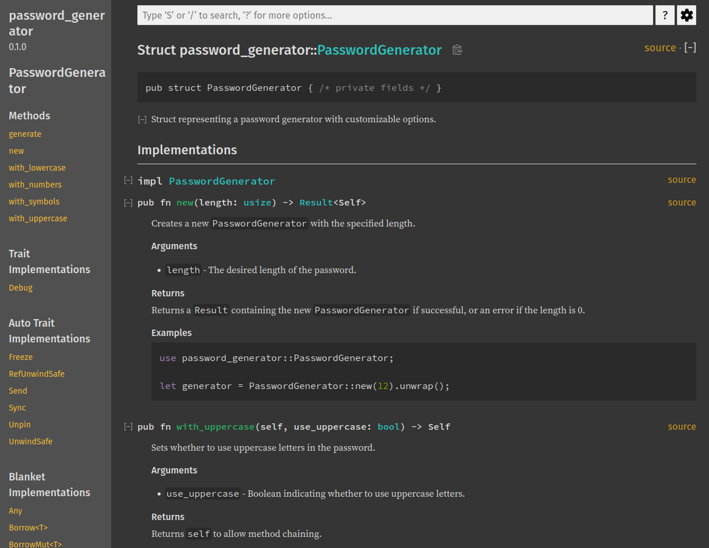
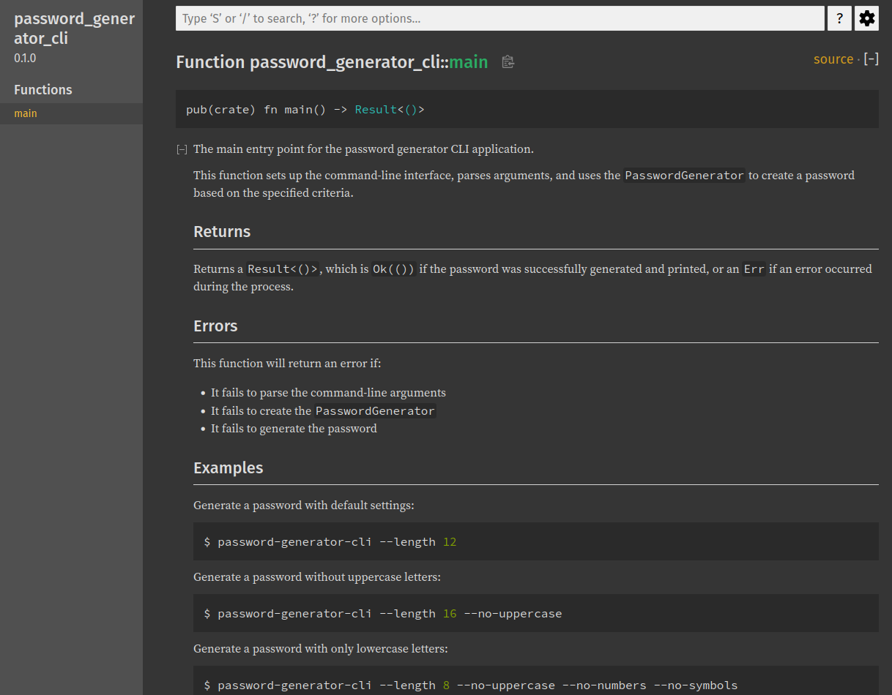

# Générateur de mots de passe en Rust - Projet éducatif - Étape 4

## Introduction

Bienvenue dans ce projet éducatif de générateur de mots de passe en Rust ! Ce projet démontre les étapes de création d'un code propre, bien structuré et testé, en utilisant Rust comme langage de programmation.

Le projet consiste en une bibliothèque de génération de mots de passe et une interface en ligne de commande (CLI) pour l'utiliser. À travers ce projet, nous explorerons les meilleures pratiques de développement, de la conception initiale aux tests approfondis.

## Structure du projet

Ce projet est organisé en plusieurs branches Git, chacune représentant une étape spécifique du processus de développement :

- `main` (Étape 0) : Conception du projet
- `etape1-code-fonctionnel` : Implémentation de base
- `etape2-gestion-logs` : Ajout de la gestion des logs
- `etape3-gestion-erreurs` : Implémentation de la gestion des erreurs avec `anyhow`
- `etape4-documentation` : Ajout de la documentation complète
- `etape5-tests` : Implémentation des tests unitaires et d'intégration

Chaque branche construit sur la précédente, ajoutant de nouvelles fonctionnalités ou améliorations.

## Étape 4 : Documentation complète

Vous êtes actuellement sur la branche `etape4-documentation`, qui représente la quatrième étape de développement de notre projet : l'ajout d'une documentation complète.

### Objectifs de cette étape

1. Ajouter des commentaires de documentation détaillés pour toutes les structures, fonctions et méthodes
2. Inclure des exemples de code dans la documentation
3. Utiliser `cargo test` pour vérifier les exemples de code dans la documentation
4. Générer une documentation HTML avec `cargo doc`
5. Améliorer la lisibilité et la compréhension du code pour les futurs développeurs et utilisateurs

### Points clés

- Écrire des commentaires de documentation clairs et concis
- Utiliser les balises Rust doc appropriées (`//!` pour la documentation de module, `///` pour les items)
- Inclure des exemples pertinents et testables dans la documentation
- Expliquer le "pourquoi" en plus du "comment" dans les commentaires
- Utiliser des liens vers d'autres parties de la documentation quand c'est pertinent
- Éviter la sur-documentation des éléments évidents
- Assurer que la documentation est à jour avec le code

### Contenu clé

- `src/lib.rs` : Documentation complète de la bibliothèque
- `src/main.rs` : Documentation de l'interface en ligne de commande
- `README.md` : Mise à jour avec des informations sur la documentation

### Fonctionnalités ajoutées

- Documentation détaillée pour chaque fonction, méthode et structure
- Exemples de code testables dans la documentation
- Documentation de module expliquant l'architecture globale

### Comment utiliser

1. Clonez le dépôt et assurez-vous d'être sur la branche `etape4-documentation`
2. Générez et ouvrez la documentation :
   ```
   cargo doc --open
   ```
3. Exécutez les tests, y compris ceux dans la documentation :
   ```
   cargo test
   ```
4. Pour utiliser le programme :
   ```
   cargo run -- --length 12
   ```

### Vérification de la documentation

- Pour vérifier que les exemples de code dans la documentation fonctionnent :
  ```
  cargo test --doc
  ```
- Pour générer la documentation sans l'ouvrir automatiquement :
  ```
  cargo doc
  ```

### Aperçu du rendu en HTML 





### Prochaines étapes

Pour voir l'implémentation des tests unitaires et d'intégration, passez à la branche `etape5-tests` :

```
git checkout etape5-tests
```

## Contribution

Ce projet est principalement éducatif, mais les suggestions d'amélioration sont les bienvenues. N'hésitez pas à ouvrir une issue pour discuter de potentielles améliorations ou corrections.

## Licence

Ce projet est sous licence MIT. Voir le fichier [LICENSE](LICENSE) pour plus de détails.
